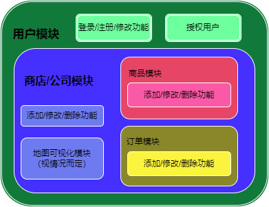

# 项目开发目标

# 项目结构

# 项目开发流程

|    时间    |                     说明                     |
| :--------: | :------------------------------------------: |
| 2022/10/22 |               这是一个新的开始               |
| 2022/10/23 |  初始化SpringBoot项目 数据库的初步建设  |
| 2022/10/24 |       引入Spring-security登录身份验证        |
| 2022/10/25 |     加客户端请求的数据加入Redis当中缓存      |
| 2022/10/26 | 使用MapReduce任务对Redis中数据做一个缓存处理 |

## 项目中遇到的问题

## 1. SpringBoot中多数据源配置

​	在`SpringBoot`中Redis数据源通过导入相关的依赖导入后，再通过`@Autowired`自动装配`RedisTemplate`实现，而要自定义导入`RedisTemplate`时需要通过代码自定义对应的Bean

1. 自定义配置文件(`properties`、`yaml`、`xml`等文件)，通过`@Value`注入到代码当中
2. 自定义`Redis线程池`、`RedisConnectionFactory`实现
3. 根据自己实际情况将`RedisTemplate`注册为`Bean`

## 2. 汇总表的操作选择

考虑到实际情况从如下中选择：

1. 通过Hadoop的MapReduce任务来实现（MapReduce的效率）
2. 使用Java中代码来实现（缓存数据到Redis当中后再取出进行Reduce到汇总表）
3. 直接将记录插入到Mysql当中，为每个字段添加时间戳（通过`SELECT count`来返回汇总数目）
4. 直接将记录存入Hive当中（Hive中`SELECT COUNT`的执行流程）

## 3. 通过接口注册用户时用户名的合法性校验（未）

